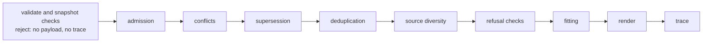
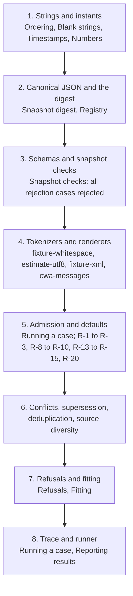

# Porting the CWA assembler to a new language

This template starts a CWA assembler in any language the way the Python reference assembler and the TypeScript assembler were built: from the published contract alone, test-first, with every conformance case as a test and a committed conformance report the website imports. Follow the steps in order. AGENTS.md holds the standing rules; this file is the guide.

## What a port is

An assembler takes a frozen snapshot, which is the profile, route policy, budget, producer batches and conflict groups an application assembled for one model call, and produces a payload and a trace. The spec gives it four steps: admit, resolve, fit, and render with a trace. The conformance README refines those into the pipeline every port implements, in this order:



A port is conformant when every published case's payload matches byte for byte and its trace matches field for field, and every rejection snapshot is rejected. Two ports that both pass every case and still disagree on something have found a gap in the spec. That is why the second port was built, and why a port never reads another port's code.

## Prerequisites

- git, with commits signed off (`git commit -s`); the maintainer's commit hook requires it.
- Python 3.10 or newer for the three bootstrap scripts under `scripts/`. They use the standard library; the `jsonschema` package is optional and adds schema validation to two of them.
- A checkout of the website repository beside this one (`../website`), at the commit to vendor.
- The language's toolchain, and a JSON Schema 2020-12 validator for it. Check the portability checklist below before choosing one: the published patterns need ECMAScript regex semantics.

## Step 1: make the repository

1. Create the repository from this template. Name it `assembler-<language>` in the organization, as `assembler-python` and `assembler-typescript` are, and the local folder takes the same name.
2. Name the port, once, from its root. The package name follows the ecosystem's convention; the TypeScript one is `@contextwindowarchitecture/assembler`. For a Go port:

   ```sh
   python3 scripts/init_port.py --language Go --package github.com/contextwindowarchitecture/assembler-go \
     --repository contextwindowarchitecture/assembler-go \
     --install "go mod download" --build "go build ./..." --test "go test ./..." --conformance "go run ./cmd/conformance"
   ```

   It fills the language and the commands into AGENTS.md and the commented test job in the CI workflow, names the package in NOTICE, replaces the template's README.md with the port's starter README (the outline at the end of this file, with `TODO` where only the port can say), fills the language and package into this guide so its commands paste as they are, and adds the GitHub remote as `origin` when the checkout has none. A command left out stays a `<placeholder>` to fill by hand; the script says which. It refuses to run twice.
3. Add the language's ignores to `.gitignore`. `vendor/` stays tracked: it is the pinned contract.
4. Add the language's manifest, and finish the test job in `.github/workflows/ci.yml`: the commented block is the shape, and the runtime setup action is the language's. Keep the `ref` on its checkout: `.github/workflows/release.yml` calls this workflow to test a tag before it releases it, and passes the tag there. The other two jobs already work, and so does the release workflow.
5. Finish README.md's `TODO` lines as the port takes shape. Keep this file while it helps, and delete it once the port stands. Then make the first commit: `chore: start the <language> assembler from the template`.

## Step 2: vendor the contract

```sh
python3 scripts/vendor_contract.py --website ../website
python3 scripts/vendor_contract.py --verify
```

This copies the contract into `vendor/cwa/` and writes `vendor/cwa.lock.json`: about 250 files, most of them case fixtures. Vendor from a committed website state; the lock records `dirty: true` otherwise, and the website then counts every case as stale. Commit as `build(contract): vendor website <short sha>`.

| Vendored path | What it is |
| --- | --- |
| `conformance/README.md` | The algorithm. Read it first and keep it open: trace ordering, the digest, conflicts, supersession, deduplication, source diversity, the fitting steps, the snapshot checks, both renderers and both tokenizers, and the report format |
| `contract/requirements.json` | R-1 to R-26, which the README cites on nearly every line |
| `contract/reasons.json` | Every exclusion and refusal code, in the order R-21 ranks them |
| `contract/slot-defaults.json` | Each slot's default authority, tier and policy fields (R-3) |
| `schema/*.schema.json` | Nine schemas: the snapshot in, the trace out, and the item, batch, conflict group, profile, route policy, registry lock and conformance report |
| `conformance/cases/` | The cases: `case.json`, `snapshot.json`, `expected.trace.json` and, unless the case expects a refusal, `expected.payload.txt` |
| `conformance/rejections/` | Snapshots that each break one snapshot check; a port rejects them before assembly |
| `conformance/registry/` | Example profiles and route policies with a lock of their digests, to test an RFC 8785 serializer against |
| `LICENSE`, `NOTICE` | The port ships under the same Apache-2.0 terms, and a test compares its LICENSE with this one |

Reading order: the README end to end, then the requirements, then `snapshot.schema.json` and `trace.schema.json`, then one case (`fixture-three-slot`) with its snapshot, trace and payload side by side. The requirements alone are not enough to build from: they say what must happen, and the README says how.

## Step 3: the guard tests

Before any assembler code, write four tests in the language's own test framework. They are the port's version of what `vendor_contract.py --verify` and `check_report.py` do, and they run with the suite on every commit:

1. **The lock.** Every path in `vendor/cwa.lock.json` exists under `vendor/cwa/` with the recorded SHA-256, and no other file is there.
2. **The license.** `LICENSE` equals `vendor/cwa/LICENSE` byte for byte, and NOTICE names the Apache License, Version 2.0.
3. **The implementation.** The name and version the report carries equal the package manifest's.
4. **The report.** `conformance-report.json` equals a fresh run, so a stale report fails the suite. This test arrives with the runner in step 5.

## Step 4: build order

Each stage names the README section that defines it. Write unit tests for the section's rules first, then let the cases that exercise them pass. The conformance test carries a `PENDING` set of case ids that only shrinks (AGENTS.md).



The order the cases fell in for the TypeScript port: the rejection cases first (stage 3), then `fixture-three-slot`, then `admission-reasons`, which exercises most of admission at once, then the `conflict-*`, `supersede-*`, `dedupe-*` and `diversity-*` cases, then `budget-*` and `protected-*`, then `messages-*`, with `ordering-astral-ids` and `threshold-beyond-2-53` as the portability checks. A vendored case the port cannot pass yet sits in `PENDING`.

### Components the application supplies

R-16 lets an application count with a tokenizer of its own, and a port may take an application's renderer too, but never under a published ID. A tokenizer under the ID of a published tokenizer, or a renderer under the ID of a published renderer, stops the call before assembly, with no payload and no trace. That holds for an ID the port does not provide itself, and for an entry the snapshot does not name. No case can hand the port a component, so this is the port's own unit test, and the three implementations so far each found a way around a first attempt:

- Guard the published list from the vendored README, not the port's built-in table, and pin the two with a test that reads the README's Tokenizers and renderers bullets, so a newly published component fails the test until the guard names it.
- If a component carries its own ID, as a Python object with an `id` does, require each key to equal it. The trace names the component by that ID, so a tokenizer passed under another key could still claim to be a published one.
- Don't export the published tables as mutable objects. A caller that overwrites a built-in entry in place gets a trace that names the published tokenizer with another count. Freeze or copy them.
- Look a snapshot's IDs up as own keys only (see the portability checklist).
- Don't call the stop a refusal: the spec keeps that word for assemblies that end with a trace.

## Step 5: the conformance runner

The port needs a command that runs every case and rejection and writes `conformance-report.json` (README, Reporting results). Until a native runner exists, `scripts/conformance.py` does it through a small adapter the port provides:

```sh
python3 scripts/conformance.py --command "<adapter command>" --name <package> --version <version> --language <Language>
```

The adapter is started once per snapshot with the snapshot file's bytes on stdin, and answers by exit code:

| Exit | Meaning | Output |
| --- | --- | --- |
| 0 | assembled, refusals included | stdout: `{"payload": <base64 of the payload bytes, or null when refused>, "trace": <the trace>}` |
| 2 | rejected before assembly (R-17) | stderr: the problems, in the port's words |
| 3 | a tokenizer or renderer the port does not provide | stderr: which one, e.g. `renderer some-renderer/v1 is not provided` |

Exit 3 skips the case only when it uses a component the vendored README does not require: one it lists under Optional, such as `cwa-message-blocks/v1`. The four components listed before Optional are required, so a port that lacks one fails every case that uses it (README, Reporting results), and `scripts/check_report.py` treats a skip of such a case as a problem. Any other exit code fails the case, with stderr as the detail. Give the adapter the raw bytes rather than a parsed object, so the I-JSON checks see the text as written. A Node adapter for the TypeScript port is a dozen lines, and one for the port will look much the same:

```js
import { readFileSync } from 'node:fs';
import { assemble, SnapshotRejectedError, UnsupportedComponentError } from '@contextwindowarchitecture/assembler';

try {
  const { payload, trace } = assemble(JSON.parse(readFileSync(0, 'utf8')));
  process.stdout.write(JSON.stringify({ payload: payload === null ? null : Buffer.from(payload).toString('base64'), trace }));
} catch (error) {
  if (error instanceof SnapshotRejectedError) { console.error(error.message); process.exit(2); }
  if (error instanceof UnsupportedComponentError) { console.error(error.message); process.exit(3); }
  throw error;
}
```

The runner compares exactly as a native runner must, validates each trace against `trace.schema.json` when `jsonschema` is installed, writes the report, and exits 1 unless every case passed and every rejection was rejected, apart from those skipped for an optional component the port leaves out. `python3 scripts/check_report.py` then checks the committed report is complete and well-formed; pass `--allow-failures` while `PENDING` is not empty. Once the port has a native runner, the report it writes must satisfy the same checker.

## Step 6: wire the port into the website

The Assembler page shows one row per implementation and counts, per requirement, the cases each one passes. Adding a port takes one import and four small edits in the website repository:

1. Make sure the port is a git repository with a commit and an `origin` remote: the import names the repository from the remote and the run from the commit. The report must name a clean website commit that the website checkout has.
2. Import: `node scripts/import-conformance-report.mjs ../assembler-<language> contract/assembler-<language>-conformance.json`.
3. Add `{ label: '<Language>', file: 'contract/assembler-<language>-conformance.json' }` to `IMPLEMENTATIONS` in `scripts/conformance-reports.mjs`, and the same pair to `IMPORTED` in `tests/website.test.mjs`.
4. Add the file to the sources-of-truth table in the website README, and update the two sentences that name the implementations: the matrix note on `assembler.html` and the Reporting results section of `conformance/README.md`.
5. `npm run build:contract`, `npm test`, `python3 conformance/check.py`, then commit. Re-import after every run of the port that changes its report.

## Portability checklist

Every row is a place where languages disagree, and the cases were written to catch it. Each is a unit test to write before the case that checks it.

| Concern | Rule | README section | Checked by |
| --- | --- | --- | --- |
| Schema regexes | The published patterns need ECMAScript regex semantics: `\uXXXX` escapes and the `(?![\s\S])` end anchor. RE2-style engines such as Go's `regexp` reject both, so pick a validator with a pluggable engine, or an ECMAScript one | Timestamps, Blank strings | `admission-reasons` |
| String order | UTF-16 code units, with a prefix first. Python, Go and Rust compare code points by default, which differs for characters beyond U+FFFF; sort by the UTF-16 encoding | Ordering | `ordering-astral-ids` |
| Whitespace | The ECMAScript set, spelled out. Python's `\s` differs at U+001C to U+001F and U+FEFF; list the characters | Blank strings, Tokenizers and renderers | `admission-reasons` |
| Numbers | Read every number as the nearest double before comparing; integers beyond 2^53 round and may tie; a number outside the double range rejects the snapshot, and must not crash the parser | Numbers | `threshold-beyond-2-53`, rejection `number-out-of-range` |
| Lone surrogates | Reject before assembly. Some parsers, Go's `encoding/json` among them, replace an unpaired surrogate escape with U+FFFD silently, so check the raw text | Snapshot checks | rejection `unpaired-surrogate` |
| Timestamps | Instants at full precision, a fraction of any length, no leap seconds, offsets to 23:59. Compare a normalized pair of seconds and fraction, not a nanosecond time type | Timestamps | `admission-reasons`, `supersede-observations` |
| Canonical JSON | RFC 8785, including ECMAScript number formatting, for the snapshot digest, the ordering of rows that share an id, and the `cwa-messages/v1` payload. The registry lock and every case's `snapshot_digest` test it | Snapshot digest, Registry, Tokenizers and renderers | every case, `messages-render` |
| Determinism | Sort every output by the stated keys; never iterate a hash map or set into output | Running a case | every case |
| No normalization | Deduplication keys compare code units: no NFC, no case folding, whatever the runtime's Unicode version | Deduplication | `dedupe-exact` |
| Fitting | One fit test per reduction over the whole rendered payload, and the margin in integer arithmetic; shortcuts may not change a decision | Fitting | `budget-margin-rounding`, `budget-slot-floor` |
| Hashes | SHA-256 over UTF-8 bytes, lowercase hex, for the digest and `result.hash` | Snapshot digest, Tokenizers and renderers | every case |
| Lookups by ID | Look up a snapshot's tokenizer, renderer and producer IDs as own keys only. A JavaScript object inherits `toString`, `constructor` and `__proto__`, which a schema-valid snapshot can name; it must get an unsupported component or an unlisted producer, never an inherited function | Tokenizers and renderers, Admission | the port's own tests; no case names one |

## README outline for the port

The TypeScript port's README is the model. In order:

1. The package name, one sentence on what it does (admits, resolves, fits, renders, traces), and a status line with the case counts it passes.
2. Install.
3. Use: the assemble call takes a snapshot in the shape of `snapshot.schema.json` and returns the payload bytes, or null when refused, with the trace; an invalid snapshot raises a rejection with its problems and no trace; an unknown tokenizer or renderer raises an unsupported-component error; callers may pass their own tokenizers, and renderers if the port takes any, under IDs no published component of that kind uses, and a published ID stops the call before assembly (R-16); `trace_id` and `timings` may differ between runs and nothing else does.
4. Requirements: runtime versions.
5. Development: the commands.
6. Cost: the fit test's cost, as the README's Fitting section states it.
7. Conformance: the command, what the report holds, what a pass means, when a case is skipped.
8. The contract: what `vendor/cwa/` is and what the lock pins.
9. License.
